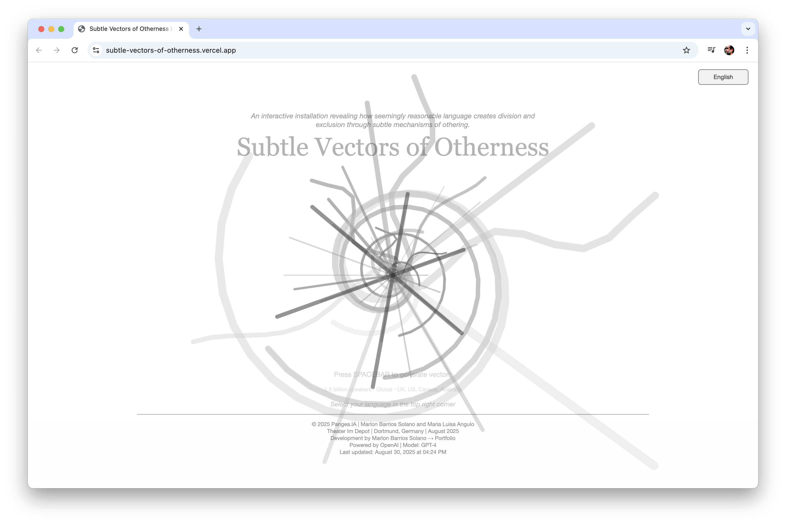
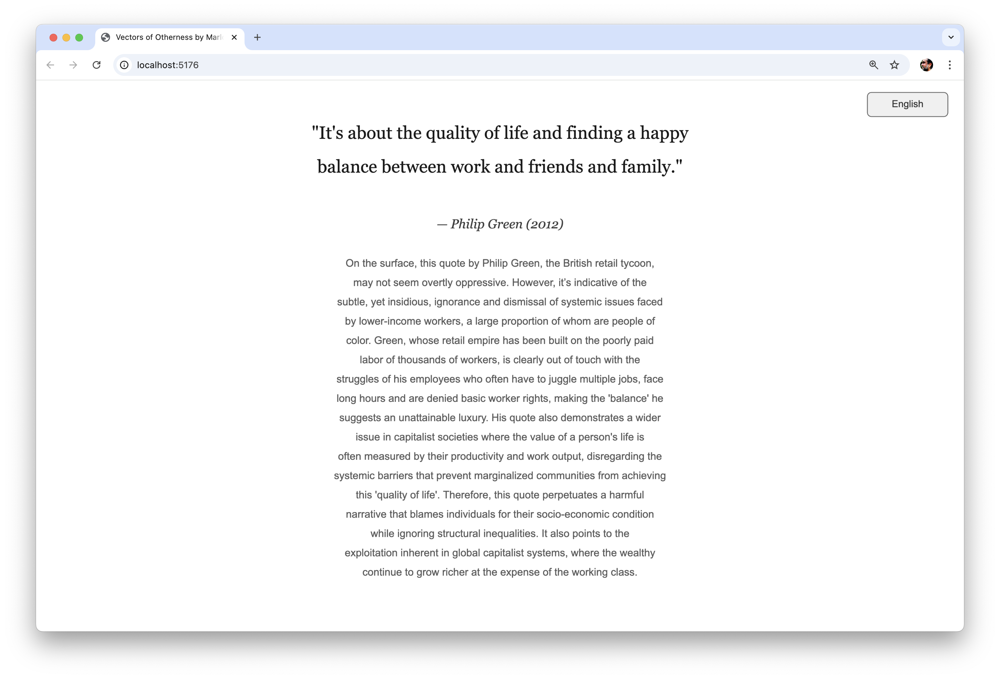
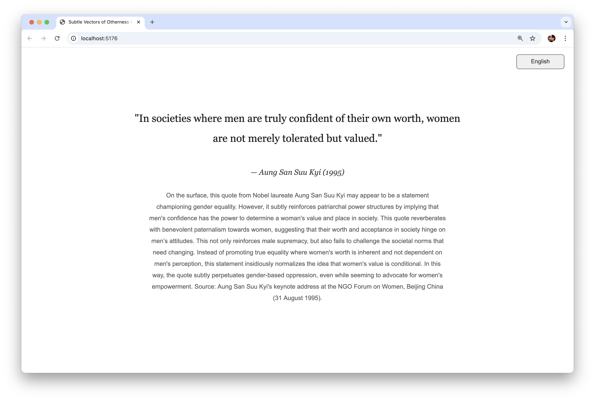
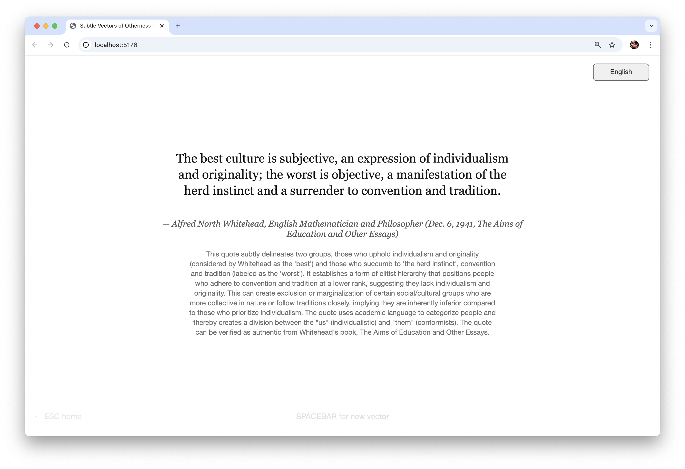
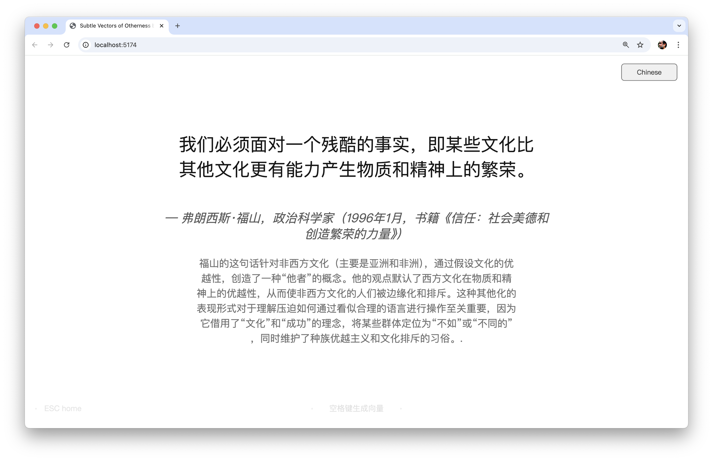

# Subtle Vectors of Otherness

An interactive generative art installation that reveals how seemingly reasonable language creates division and exclusion through subtle mechanisms of othering.

**🌐 [Experience the Live Installation](https://subtle-vectors-of-otherness.vercel.app/)**



## About the Installation

**Subtle Vectors of Otherness** is a critical media art installation designed for art exhibitions that explores the origins and mechanisms of racism, colonialism, and oppression. The work examines how language—even when it appears neutral or beneficial—can carry hidden vectors of otherness that create division and exclusion.

This installation is part of **Pangea_IA**, a collaborative project developed in partnership with **Maria Luisa Angulo** that explores the intersection of artificial intelligence, cultural identity, and critical discourse in contemporary digital art practices.

This interactive installation presents historical and contemporary quotes from leaders, thinkers, and public figures, accompanied by critical analysis that reveals the subtle ways these statements contribute to systems of oppression. The work prioritizes voices and perspectives from the Global South, Indigenous communities, and marginalized populations to provide a comprehensive understanding of how otherness operates across cultures and contexts.

## Screenshots

### Home Page - Multilingual Interface


*The installation's home page featuring the dynamic curly vector animation, artwork definition, and multilingual language selection interface.*

### Quote Generation - Critical Analysis


*Example of generated content showing a historical quote with comprehensive otherness analysis, demonstrating the installation's educational approach.*

### Language Selection Menu


*The scrollable language selection menu showing support for 70+ languages with proper font rendering for diverse writing systems.*

### Exhibition Footer


*The footer section displaying project credits, exhibition information, and interactive portfolio link for the Pangea_IA collaboration.*

## Concept

The installation reveals how oppression operates through language at multiple levels:

- **Overt vs. Subtle Oppression**: While some statements are clearly harmful, others appear reasonable or even beneficial while still carrying discriminatory implications
- **Intersectionality**: Examining how different forms of oppression (race, gender, sexuality, class, disability, religion, age, nationality, etc.) intersect and compound
- **Global Perspective**: Prioritizing diverse sources from Africa, Asia, Latin America, the Middle East, Indigenous communities, and postcolonial contexts
- **Critical Analysis**: Each quote is accompanied by educational context that explains why and how it generates otherness

## Features

### 🌍 **Multilingual Support**
- **70+ Languages**: Complete interface translation and content generation
- **Proper Font Support**: Specialized fonts for CJK (Chinese, Japanese, Korean), Arabic, Hebrew, Thai, Hindi, Bengali, Russian, and African languages
- **Cultural Sensitivity**: Language-specific considerations and culturally appropriate content

### 🎨 **Interactive Experience**
- **Symmetrical Interface**: Perfectly balanced model selection (top-left) and language selection (top-right)
- **Spacebar Generation**: Press spacebar to generate new content
- **Language Selection**: Scrollable dropdown menu with all available languages
- **Model Selection**: Choose between GPT-4 and GPT-5 for different analysis styles
- **Responsive Design**: Adapts to different screen sizes and devices
- **Smooth Animations**: Dynamic loading animation with curly vector patterns
- **Minimal Design**: Clean grayscale interface suitable for exhibition spaces

### 🧠 **AI-Powered Content**
- **Dual Model Support**: Choice between GPT-4 (default, reliable) and GPT-5 (advanced reasoning)
- **Model Selection Interface**: Top-left button for switching between AI models
- **Memory System**: Prevents repetition and builds contextual awareness
- **Fact-Checking**: Strict requirements for historically accurate quotes and sources
- **Educational Context**: Comprehensive "otherness analysis" for each quote

### 📱 **Technical Features**
- **Liquid Typography**: Responsive text that adapts to content and screen size
- **Professional Layout**: Advanced p5.js text rendering with overflow protection
- **Multi-stage Scaling**: Guarantees all content fits without truncation
- **Error Handling**: Robust validation and user feedback

## Installation Setup

### Prerequisites
- **Node.js** (version 16 or later)
- **OpenAI API Key** (GPT-4 access required)

### Quick Start

1. **Clone or Download** this repository
2. **Install Dependencies**:
   ```bash
   npm install
   ```
3. **Set API Key**: Create a `.env` file in the root directory:
   ```
   VITE_OPENAI_KEY=your_openai_api_key_here
   ```
4. **Start Development Server**:
   ```bash
   npm run dev
   ```
5. **Open in Browser**: Navigate to `http://localhost:5173/`

### Production Deployment
- Configure environment variables for your hosting platform
- Ensure proper HTTPS setup for API security
- Test across different devices and browsers

## How to Use

### **For Exhibition Visitors:**
1. **Choose AI Model**: Click the model button (top-left) to select GPT-4 or GPT-5
2. **Select Language**: Click the language dropdown (top-right) to choose from 70+ languages
3. **Read Definition**: The home page explains what "Subtle Vectors of Otherness" means
4. **Generate Content**: Press SPACEBAR to generate a quote and analysis
5. **Navigate**: Press ESC to return to the home page, SPACEBAR to generate new content
6. **Switch Models**: Try different AI models to compare analysis styles

### **For Curators and Exhibitors:**
- **Full-screen Mode**: The installation is designed for full-screen display
- **Model Control**: Choose GPT-4 for reliable, cost-effective operation or GPT-5 for advanced analysis
- **Symmetrical Design**: Professional interface with balanced corner controls
- **No Internet Required**: Once loaded, works offline (except for new generations)
- **Accessible**: Supports screen readers and keyboard navigation
- **Educational**: Each quote includes context about why it demonstrates otherness

## Technical Architecture

### **Frontend**
- **p5.js**: Creative coding framework for animations and interactions
- **Vite**: Modern build tool and development server
- **Vanilla JavaScript**: No framework dependencies for maximum compatibility

### **AI Integration**
- **Dual Model Support**: GPT-4 (default) and GPT-5 with model-specific optimizations
- **Smart Configuration**: Reasoning parameters for GPT-5, temperature control for GPT-4
- **Custom Prompts**: Sophisticated prompt engineering for educational content
- **Multi-language Support**: Consistent generation across all supported languages

### **Text Rendering**
- **Liquid Typography**: Custom text wrapping and sizing system
- **Font Management**: Language-specific font stacks for proper character display
- **Responsive Layout**: Adapts to content length and screen size
- **Symmetrical UI**: Perfectly balanced interface with identical button styling

## Content Guidelines

The installation focuses on **subtle mechanisms of otherness** rather than overtly hateful content:

### **Appropriate Content:**
- Statements that appear neutral but contain hidden biases
- Historical quotes that reveal systemic thinking patterns
- Contemporary examples of subtle discrimination
- Educational analysis of power structures and language

### **Content Sources:**
- **Global South Leaders**: Political figures, activists, intellectuals
- **Indigenous Voices**: Traditional leaders, contemporary advocates
- **Postcolonial Thinkers**: Critics of colonial and neocolonial systems
- **Marginalized Communities**: Voices often excluded from mainstream discourse
- **Historical Figures**: Those whose statements reveal systemic patterns

## Educational Value

This installation serves as:
- **Critical Media Literacy**: Teaching how language shapes perception
- **Historical Education**: Revealing patterns of oppression across time and cultures
- **Cultural Awareness**: Centering non-Western perspectives and experiences
- **Intersectional Analysis**: Examining how different forms of oppression interact

## Artist Statement

"Subtle Vectors of Otherness" invites viewers to examine the hidden mechanisms through which language creates division. By revealing the subtle ways that seemingly innocent statements can perpetuate systems of exclusion, the work challenges audiences to develop more critical media literacy and cultural awareness.

The installation prioritizes voices from the Global South and marginalized communities, countering the dominance of Western perspectives in discussions of oppression and otherness. Through multilingual presentation and culturally sensitive analysis, the work demonstrates how these mechanisms operate across different cultural contexts.

## Interface Design

### **Symmetrical Layout**
The installation features a carefully designed symmetrical interface:
- **Top-Left**: Model selection button (GPT-4/GPT-5) 
- **Top-Right**: Language selection button (70+ languages)
- **Identical Styling**: Both buttons use matching grayscale colors and dimensions
- **Perfect Balance**: 10px margins from corners with 100px × 30px button size
- **Professional Appearance**: Clean, minimal design suitable for gallery exhibition

### **Visual Harmony**
- **Grayscale Palette**: Subtle, non-intrusive button styling
- **Consistent Typography**: Responsive text sizing across all interface elements  
- **Cultural Sensitivity**: Clean design works across all cultural contexts
- **Exhibition Ready**: Professional aesthetic appropriate for museum spaces

## Technical Support

### **Common Issues:**
- **API Key Problems**: Ensure your OpenAI API key is valid and has GPT-4/GPT-5 access
- **Model Selection**: GPT-4 is more reliable; try switching if GPT-5 isn't working
- **Font Display**: Some languages may require additional system fonts
- **Performance**: Close other applications if experiencing lag during generation

### **Browser Compatibility:**
- **Recommended**: Chrome, Firefox, Safari (latest versions)
- **Mobile**: Works on tablets and phones but optimized for desktop display
- **Accessibility**: Supports keyboard navigation and screen readers

## Contributing

This is an art installation created for exhibition contexts. While the code is available for educational and research purposes, please contact the artist before making derivatives or adaptations.

## Credits

**Pangea_IA Project**: Collaborative project by Marlon Barrios Solano and Maria Luisa Angulo  
**Concept and Programming**: Marlon Barrios Solano  
**Collaboration**: Maria Luisa Angulo  
**Technical Framework**: Built with p5.js, OpenAI GPT-4, and Vite  
**Cultural Consultants**: Various community voices and perspectives  

## License

MIT License - See LICENSE file for details

## Contact

For exhibition opportunities, technical support, or collaboration inquiries:
- **Website**: [Marlon Barrios Solano](https://linktr.ee/marlonbarriososolano)
- **Email**: Contact through official channels

---

*"Subtle Vectors of Otherness" is designed to foster critical thinking about language, power, and identity in contemporary society. The installation encourages viewers to examine not just overt discrimination, but the subtle ways that everyday language can perpetuate systems of exclusion and othering.*# Updated: Fri Sep 26 20:41:06 CEST 2025
